# MVC-Project
### Kullanılan Araçlar ve Teknolojiler:

- Katmanlı Mimari
  
-  Entity Framework
  
-  Migration
  
-  Mvc Pattern

## Proje Hakkında:
Veritabanı olarak MSSQL kullanılmıştır, CodeFirst yardımıyla. Proje C# Mvc5 ile Solid Prensiplerine uygun şekilde N-tier architecture yapısını ezmeden kodlanmıştır. Business, Entity, DataAccess ve Presentation olmak üzere 4 temel katmandan oluşmaktadır. Projenin frontend tarafında Html5, Css, Bootstrap, Javascript, Jquery bileşenlerine yer verilmiştir. 

---

## Projenin Görselleri:

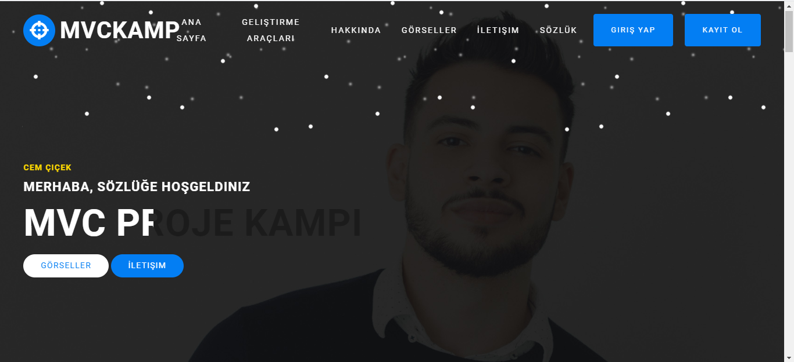

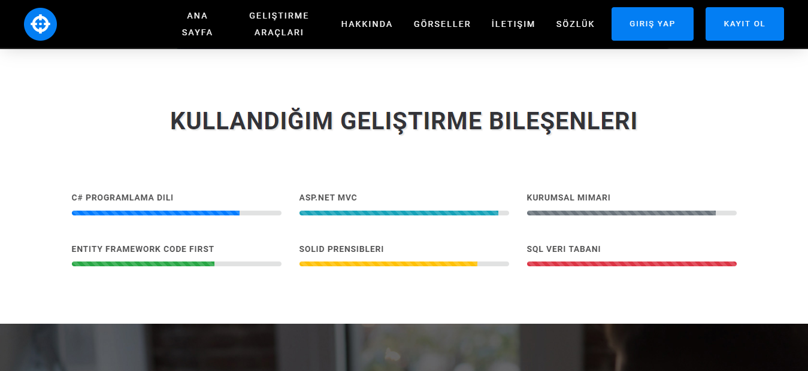

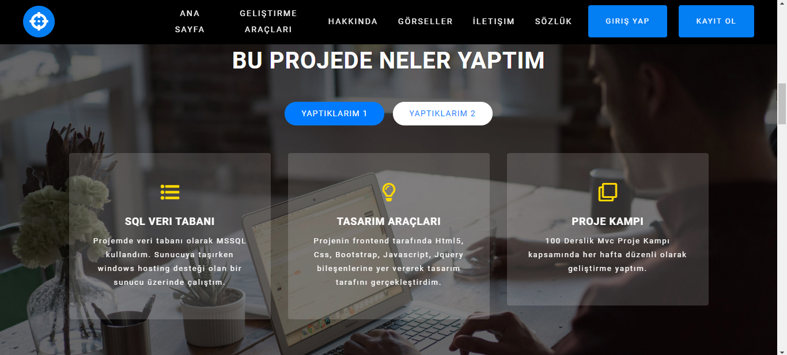

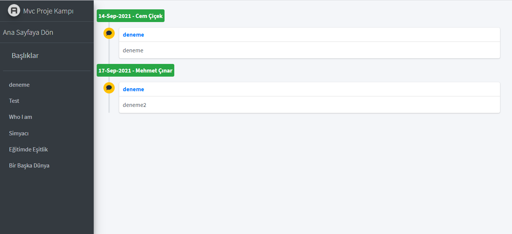

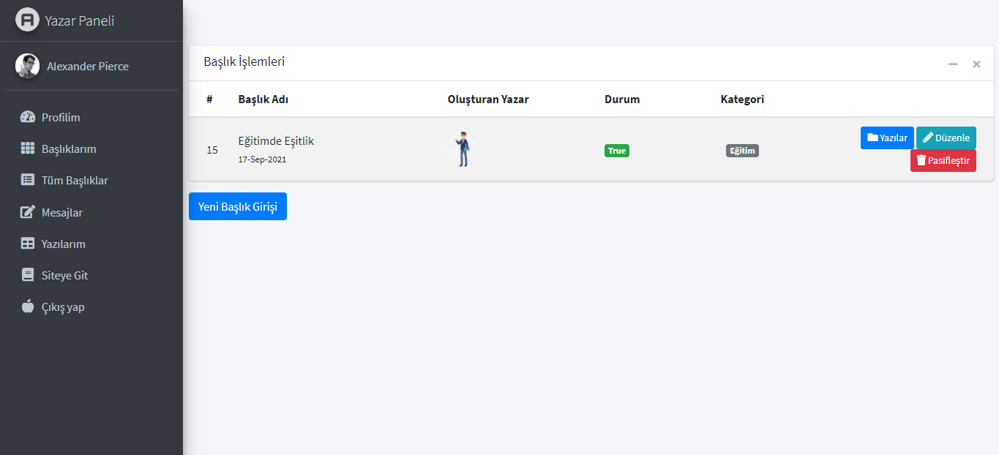

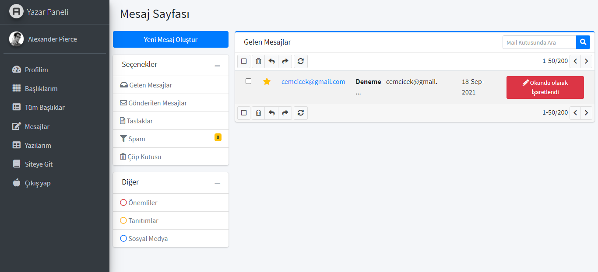

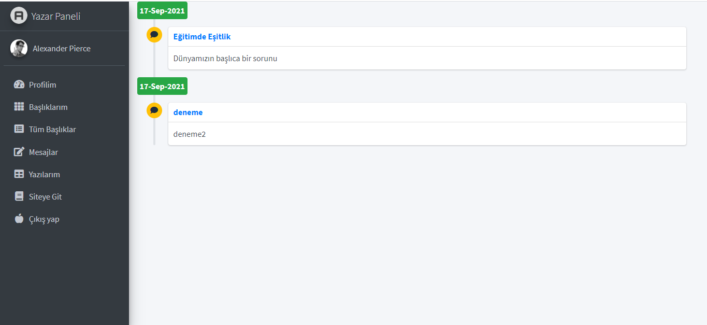

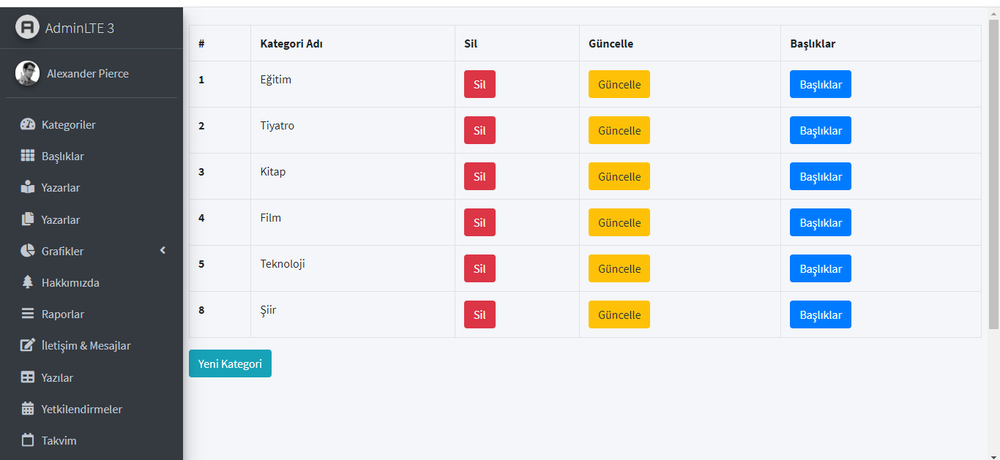

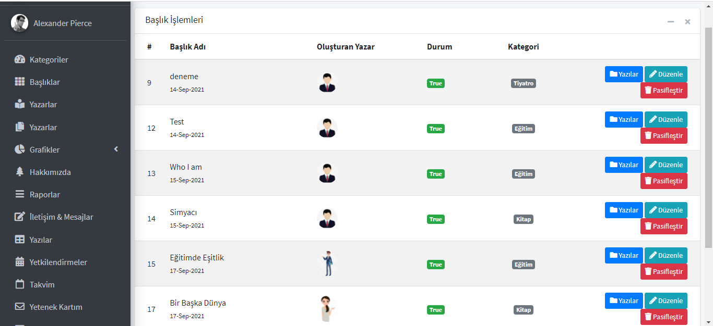

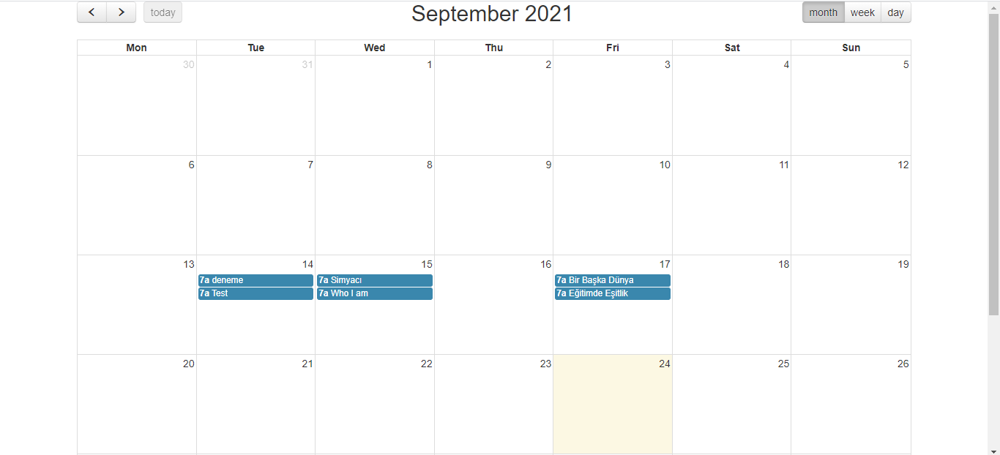

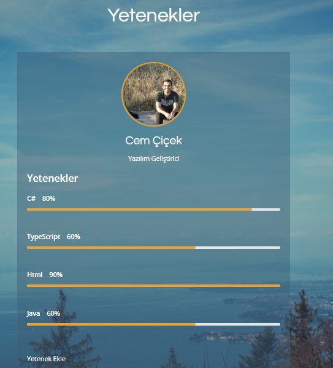

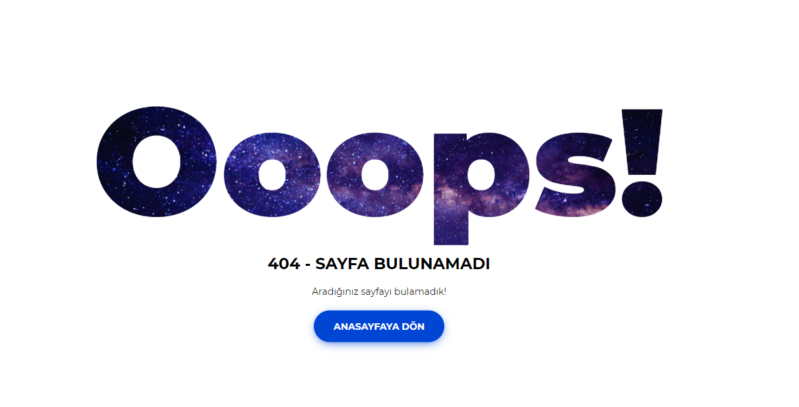

